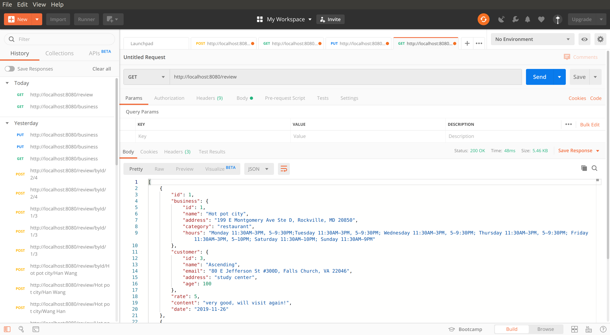

# Yelp Simulator BootCamp Project
## Project Original Thoughts:
The word "foodie" seems the best fit when I try to describe myself with one single word. In fact, I do spend a lot of time searching for good restaurants. Therefore I come up with the idea to replicate the famous food review application "Yelp".

## Project Technical Overview:
 This application is developed in Spring Framework by using Spring Boot, Spring Data, Hibernate, Spring RESTful web services, Postman, Maven, PostgresSql, Docker, Amazon SQS, and Amazon S3.
 
## Project Approach:
(To avoid repeating, unit tests will not be listed after each procedure but they were performed and passed :D)

1. Create model (package) classes for Business, Customer, Review;

2. Use flyway to perform database schema migration;

3. Use JDBC to interact with PostgresSQL server including CRUD operations;

4. Replace JDBC with Hibernate framework (Finish Persistent Layer);

5. Create repository and service packages, implement business logic (Finish Service Layer);

6. Add controller classes, achieve the goal of handling requests and responses of clients;

7. Test Restful APIs with Postman;

TO DO:
8. Add authentication and certification;

9. Integrate third-party application AWS SQS and do Mock test

10. Package project into a Docker image
## Database Setup:
Use `docker` to setup local environment(create image and container):

        docker pull postgres
        docker run --name ${PostgresContainerName} -e POSTGRES_USER=${username} -e POSTGRES_PASSWORD=${password} -e POSTGRES_DB=${databaseName} -p ${hostport}:${containerport} -d postgres
## Database Relation:
##### Table: 
Business: id, name, address, category, hours; 
Customer(User): id, name, email, address, age; 
Review: businessId, customerId, rate, content, createDate.

##### Relation:
1. Both Business and Customer tables have id as their primary key separately.
2. Single record of review consists of one customer and one business.
3. One Business may have many Customers reviewed, similarly, One customer may review many businesses.

#### Flyway migration (at workspace):
        mvn flyway:info
        mvn flyway:migrate
## JVM option configuration:
        Ddatabase.driverName=${driverName}
        Ddatabase.url=${url}
        Ddatabase.port=${port}
        Ddatabase.name=${name}
        Ddatabase.username=${username}
        Ddatabase.password=${password}
## Demo 
#### Postman snapshot for retrieving reviews:
